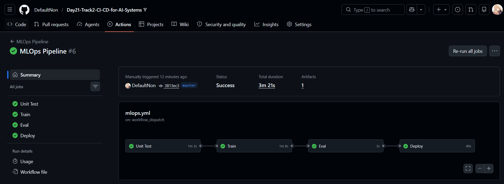
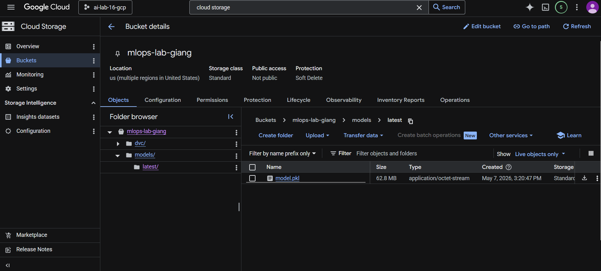
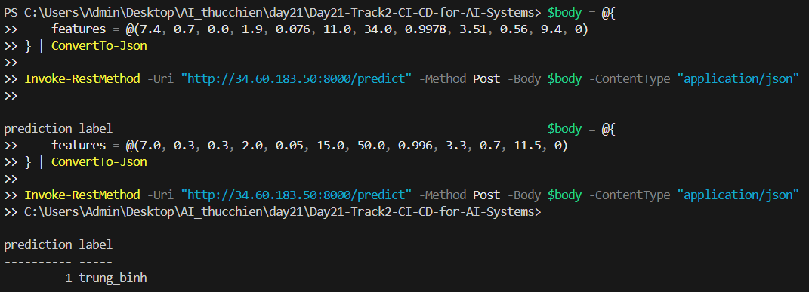

# Báo cáo Lab 21: CI/CD cho Hệ thống AI (MLOps)

## 1. Thông tin chung
- **Học viên:** [Họ tên của bạn]
- **Bài Lab:** Day 21 - Track 2: CI/CD for AI Systems
- **Repository:** https://github.com/DefaultNon/Day21-Track2-CI-CD-for-AI-Systems
- **Trạng thái:** Hoàn thành toàn bộ các yêu cầu cơ bản và nâng cao.

## 2. Các thành phần chính đã triển khai
### A. Quản lý dữ liệu và Model
- Sử dụng **DVC** để quản lý phiên bản dữ liệu và model, lưu trữ tại Google Cloud Storage.
- Tích hợp **MLflow** để theo dõi (tracking) các thí nghiệm huấn luyện và đánh giá.

### B. CI/CD Pipeline (GitHub Actions)
Xây dựng luồng tự động hóa gồm 4 giai đoạn:
1. **Unit Test**: Kiểm tra logic code huấn luyện trên dữ liệu giả lập.
2. **Train**: Tự động huấn luyện mô hình RandomForest và log kết quả vào MLflow.
3. **Eval**: Đánh giá mô hình trên tập dữ liệu kiểm tra (Threshold Accuracy >= 0.70).
4. **Deploy**: Tự động đóng gói, thiết lập môi trường và triển khai mô hình lên GCP Compute Engine qua SSH.

### C. Inference Service
- Xây dựng API dự đoán bằng **FastAPI**.
- Triển khai thành công dưới dạng **Systemd Service** trên máy ảo Ubuntu.

## 3. Minh chứng kết quả (Screenshots)

### 3.1. GitHub Actions Pipeline thành công

*Hình 1: Pipeline chạy thành công toàn bộ 4 giai đoạn.*

### 3.2. Google Cloud Storage Artifacts

*Hình 2: Model đã được đẩy lên Cloud Storage thành công.*

### 3.3. Kết quả Dự đoán thực tế (API Health & Prediction)

*Hình 3: Gọi API dự đoán từ máy cá nhân đến Server Cloud trả về kết quả chính xác.*

## 4. Kết luận
Hệ thống MLOps đã hoạt động ổn định, đảm bảo tính nhất quán từ giai đoạn code đến giai đoạn phục vụ mô hình thực tế. Mô hình đạt độ chính xác cao và có khả năng tự động cập nhật khi có dữ liệu hoặc code mới.
